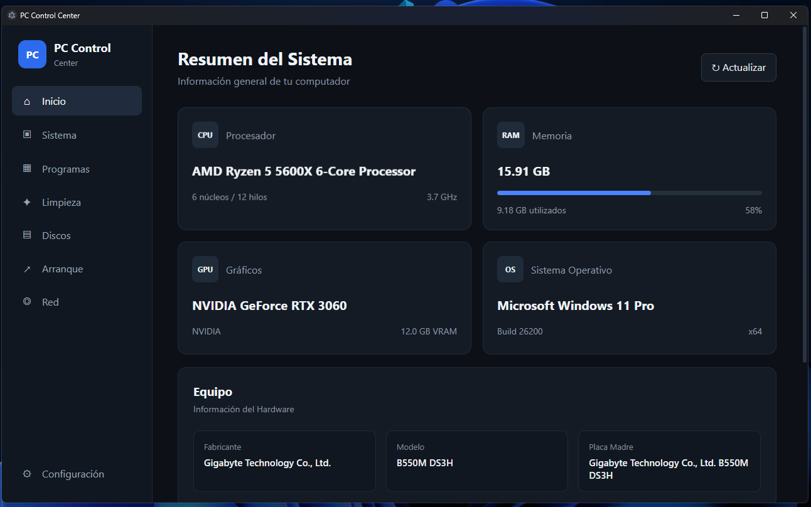
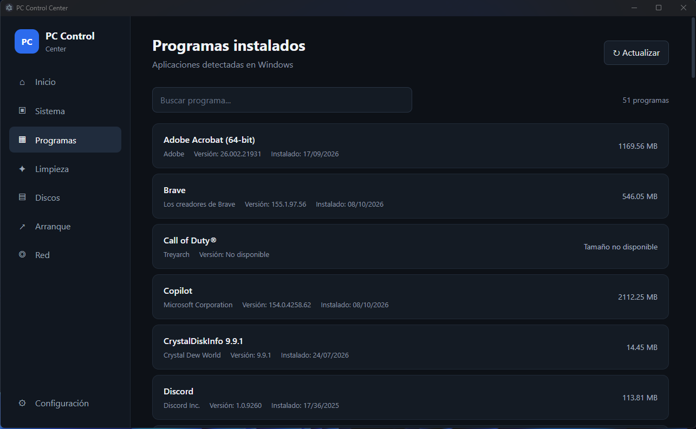

# PC Control Center

PC Control Center es una aplicación de escritorio desarrollada con Electron y JavaScript que busca centralizar diferentes herramientas de administración y diagnóstico de un computador Windows.

Actualmente el proyecto permite consultar información del hardware y sistema operativo, visualizar unidades de almacenamiento y consultar los programas instalados en Windows.

> Proyecto en desarrollo

---

## Características

Actualmente PC Control Center incluye:

- Información del sistema
- Información del procesador
- Información de memoria RAM
- Información de GPU
- Información de almacenamiento
- Información del sistema operativo
- Listado de programas instalados
- Búsqueda de programas
- Actualización de información del sistema
- Interfaz gráfica oscura
- Arquitectura basada en Electron

### Próximamente

- Desinstalación de programas
- Limpieza de archivos temporales
- Información avanzada de discos
- Gestión de programas de inicio
- Información de red
- Configuración de la aplicación
- Información avanzada del hardware
- Herramientas de mantenimiento

---

## Capturas

### Inicio



### Programas instalados



---

## Tecnologías utilizadas

- JavaScript
- HTML5
- CSS3
- Electron
- Node.js
- systeminformation
- PowerShell
- Windows Registry

---

## Requisitos

### Para utilizar la versión compilada

- Windows 10 o Windows 11
- Arquitectura x64

No es necesario instalar Node.js ni Visual Studio Code para utilizar la versión compilada.

### Para ejecutar el proyecto desde el código fuente

- Windows 10/11
- Node.js
- npm
- Git
- Visual Studio Code (recomendado)

---

## Instalación

### Usuario final

Puedes descargar la última versión desde la sección:

**Releases**

Descarga el instalador `.exe` y sigue las instrucciones del instalador.

---

##  Ejecutar desde código fuente

Clona el repositorio:

```bash
git clone https://github.com/PIPEDEBUG/PC-Control-Center.git